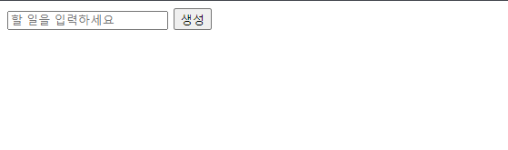

---
layout:
  title:
    visible: true
  description:
    visible: false
  tableOfContents:
    visible: true
  outline:
    visible: true
  pagination:
    visible: true
---

# 투두리스트 - 함수 사용

간단하게 브라우저 환경에서 자바스크립트를 사용하여 투두리스트를 만들어보며 진행해보도록 하겠습니다. 먼저 함수 기반으로 기능들을 구현하고 점진적으로 수정해보도록 할게요.

```html
<!DOCTYPE html>
<html lang="en">
<head>
    <meta charset="UTF-8">
    <meta name="viewport" content="width=device-width, initial-scale=1.0">
    <title>Document</title>
    <script defer src="./src/app.js"></script>
</head>
<body>
    <form id="todoForm">
        <input id="contentInput" placeholder="할 일을 입력하세요" />
        <button>생성</button>
    </form>
    <ul id="todoContainer"></ul>
</body>
</html>
```

웹페이지를 통해 사용자와 상호작용을 하기 위해 최소한의 구성을 이루었습니다. 어떻게 구현할까 고민하다가 변경되지 않는 입력 부분은 미리 태그들을 구성해  놓고 동적으로 리스트가 생성될 영역은 내용을 비워두었습니다. 나중에 자바스크립트를 통해 사용자 상호작용이 일어나면 동적으로 화면이 생성되게 할 생각입니다.

<figure><figcaption></figcaption></figure>

다음으로 자바스크립트 코드를 보도록 할게요. html 문서에 연결해주었던 index.js 파일입니다.

```javascript
let todoList = [];

const addTodo = (content) => {
    if (!content) {
        window.alert('내용을 입력해 주세요.');
        return;
    }

    const generateId = new Date().getTime().toString();

    todoList.push({
        id: generateId,
        content,
        finished: false,
    });
};

const checkTodo = (id) => {
    todoList = todoList.map((todo) => {
        if (todo.id !== id) {
            return todo;
        }
        return { ...todo, finished: !todo.finished };
    });
}

const removeTodo = (id) => {
    todoList = todoList.filter((todo) => todo.id !== id);
} 
```

할일이라는 데이터를 저장하기 위해 todoList 배열을 만들어주었습니다. 이후에 생성, 완료 또는 취소, 삭제 라는 행동들을 함수로 만들어주었죠.&#x20;

함수들의 공통점은 todoList라는 배열의 값을 변화시킨다는 것 입니다. 이 부분을 이용해서 todoList의 값이 변화하는 시점마다 동적으로 화면을 변화시켜주면 될 것 같아요.

작업을 하기 위해서는 먼저 html 문서에 작성된 상호작용이 필요한 요소들을 가져와서 이벤트를 감지하고 이벤트에 따라 해당 함수들을 호출하면 될 것 같아요.

위에 작성된 코드의 하단에 바로 작성한 내용입니다.

```javascript
const formElement = document.querySelector('#todoForm');
const inputElement = document.querySelector('#contentInput');
const containerElement = document.querySelector('#todoContainer');

formElement.addEventListener('submit', (event) => {
    event.preventDefault();

    addTodo(inputElement.value);

    inputElement.value = '';

    updateUI();
});

containerElement.addEventListener('click', (event) => {
    const targetAction = event.target.getAttribute('data-action');
    const targetTodoId = event.target.getAttribute('data-id');

    switch (targetAction) {
        case 'checkTodo':
            checkTodo(targetTodoId);
            break;
        case 'removeTodo':
            removeTodo(targetTodoId);
            break;
        default:
    }

    updateUI();
});

const updateUI = () => {
    containerElement.innerHTML = todoList.map((todo) => {
        const contentTag = todo.finished ? 'del' : 'span';
        return `
        <li>
            <input data-action="checkTodo" data-id="${todo.id}" type="checkbox" ${todo.finished ? 'checked' : ''}  />
            <${contentTag}>${todo.content}</${contentTag}>
            <button data-action="removeTodo" data-id="${todo.id}">삭제</button>
        </li>
        `;
    }).join('');
}
```

상단의 formElement 는 버튼이 클릭되었을 때 submit 이벤트를 감지하고 실행됩니다. 페이지를 리랜더링 하는 submit 이벤트의 전파를 막고 상단에 작성해둔 할일 추가 기능을 연결하였습니다.&#x20;

containerElement 요소는 단순히 클릭 이벤트가 일어 났을 때 이벤트 버블링을 이용하여 내부의 요소가 자신까지 전파될 때 특정 요소를 조건으로 찾아냅니다. 조건으로 찾아낸 요소에 따라 완료/취소 또는 삭제를 하는 행동 함수를 호출합니다.&#x20;

그리고 두 이벤트 모두 작업이 끝날 때 updateUI 라는 함수를 호출하게 되는데 이 함수는 실행되는 시점에 todoList의 값을 조회하여 순회하며 containerElement 요소에 html 요소를 동적으로 그리게 됩니다.

위 작업이 끝나게 되면 다음과 일단 투두리스트의 기능은 잘 작동하는 것 같아요.

<figure><figcaption><p>조금 허접하다..</p></figcaption></figure>

기능은 작동하지만 몇가지 불편한 부분들이 있습니다. 할일 도메인을 조작하는 로직과 DOM 요소를 조작하는 로직이 한눈에 구분되지 않는다는 점이죠.

또 걸리는 점은 todoList에 대한 행동 함수들을 잘 만들어 주었지만, DOM을 조작하고 todo 도메인의   기능을 사용하는 로직에서는 이 함수말고도 todoList 배열에 직접 접근이 가능한 상황이에요.

조금 억지를 부려 다음과 같은 행동이 가능하다고 생각할 수 있겠습니다.

```javascript
let todoList = [];

...

formElement.addEventListener('submit', (event) => {
    event.preventDefault();
    
    // addTodo(inputElement.value); <- 기존 코드

    // todoList 배열에 직접 접근하여 값을 주입
    // 의도했던저장되는 데이터형태는 객체이나 여기서는 string|undefind 값을 저장
    // 런타임 환경 이전에는 문제가 되지 않는다.
    todoList.push(inputElement.value);

    inputElement.value = '';

    updateUI();
});
```

이 코드는 처음부터 제가 작성했기 때문에 이렇게 멍청한 실수를 하지는 않겠죠. 하지만 코드가 시간에 비례하여 늘어나고 점점 파악하기 힘들어진다고 하면, 저는 아마도 이런 실수를 할 수도 있다고 생각합니다.

협업을 할 때는 더더욱 문제가 될 수 있겠죠. 코드를 작성한 개발자의 의도가 뭔지 파악해야하고 잘못된 방식으로 기능을 사용할 수 있게 됩니다.

다음 글에서는 할일 도메인을 다루는 부분을 class를 사용하는 방식으로 코드를 변경하고 이 문제를 해결해보도록 할게요. 이번 글에 작성된 소스코드들은 아래 링크에서 확인해 볼 수 있습니다.



점차 개선되는 방식들도 리파지토리에 태그단위로 분류 해두었으니 참고해주세요!
