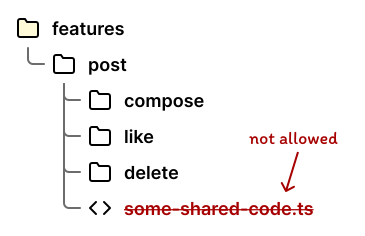

---
layout:
  title:
    visible: true
  description:
    visible: false
  tableOfContents:
    visible: true
  outline:
    visible: true
  pagination:
    visible: true
---

# FSD에 관하여

시작하기 전에

개발자로서 고품질 코드를 추구하는 것은 중요한 일이라고 생각됩니다. 고품질 코드는 유지보수가 쉽고, 읽기 쉬우며, 효율적이고, 확장 가능해야 합니다.  (_고품질 코드의 정의는_ [_**디자인패턴의 아름다움**_](https://www.yes24.com/Product/Goods/118859035) _이라는 책에서 찾아 볼 수 있습니다.)_

그런데 이러한 고품질 코드를 작성하는데  방해가 되는 요소가 있습니다. 바로 코드를 관리하는 폴더 (패키지) 간의 의존성 입니다.&#x20;

폴더 구조는 항상 의미를 부여하며 합리적으로 만들었다고 생각되는데 뭔가 찜찜한.. 하지만 뭐가 찜찜한건지 잘 모르는 그런 현상들이 있었습니다. 그러다 언젠가 이 영상을 보게 되었는데요. 6분 50초 쯤으로 넘어가시면 패키지 의존성에 대해 짧게나마 이야기를 하고있습니다. 11분 28초까지 꼭 보시면 좋을 것 같아요.


6분 50초쯤에 패키지 의존성에 대해 다룹니다.


클래스 파일을 포함하고 있는 폴더, 즉 패키지 구조 역시 코드의 의존성에 영향을 미칩니다. 패키지 간의 의존성이 복잡하게 얽혀 있으면, 코드를 추적하고 관리하기 어려워집니다.&#x20;

**기능 분할 디자인(FSD)** 를 프로젝트에 적용하게 되면 **레이어 참조 규칙**, **슬라이스  공개  API 규칙**을 통해 위 영상에서 말하는 패키지간의 의존성을 관리하기 쉽게 하는 모범 사례를 만들어 낼 수 있다고 생각합니다.

## 기능 분할 디자인(FSD) 소개


공식문서를 보고 FSD에 대해 정리하였습니다. 문서는 Deepl 번역을 사용하여 최대한 사이트가 전달하고자 하는 내용을 정확하게 인지하도록 노력했습니다.

공식 문서: [https://feature-sliced.design/](https://feature-sliced.design/)


**Feature Slided Design** 이하 **기능 분할 설계** 는 프런트엔드 애플리케이션을 스캐폴딩하기 위한 아키텍처 방법론입니다. 간단히 말해, 코드 구성에 관한 규칙과 규칙의 모음입니다. 이 방법론의 주된 목적은 끊임없이 변화하는 비즈니스 요구사항에 맞서 프로젝트를 더 이해하기 쉽고 체계적으로 만드는 것입니다.

## FSD의  계층 구조와 규칙 💎

대부분의 프론트엔드 프로젝트의 폴더 구조를 봤을 때 **src 폴더** 하위부터 작업하는 소스코드의 영역이므로 계층의 시작점은 src 폴더를 기본 경로로 잡고 시작한다고 생각합니다.

참고용 샘플 저장소들 입니다. (레이어의 위치, 구조만 파악해주세요)

참고 샘플

[https://github.com/UmttikhinaDasha/IT-Bookstore](https://github.com/UmttikhinaDasha/IT-Bookstore)

[https://github.com/ruslan4432013/fsd-react-query-example](https://github.com/ruslan4432013/fsd-react-query-example)

[https://github.com/vissh/vkui-audiopad/tree/master/packages/front](https://github.com/vissh/vkui-audiopad/tree/master/packages/front)

### Layer (레이어)

레이어는 기능 분할 디자인에서 첫 번째 수준의 조직 계층 구조입니다. 현재날짜(2024.05.23) 기준으로 총 6개의 레이어가 있습니다. 프로젝트에서 모든 레이어를 사용할 필요는 없으며, 필요하지 않은 레이어를 억지로 만들 필요는 없습니다.

1. <mark style="background-color:blue;">**app**</mark>
2. <mark style="background-color:purple;">**pages**</mark>
3. <mark style="background-color:orange;">**widgets**</mark>
4. <mark style="background-color:red;">**features**</mark>
5. <mark style="background-color:yellow;">**entities**</mark>
6. <mark style="background-color:green;">**shared**</mark>

_각 레이어의 역할은 가장 마지막에 **슬라이스**와 **세그먼트**를 포함하여 다루도록 하겠습니다._

### 레이어 참조 규칙 ✨ 

**레이어**의 참조 규칙을 설명하려면 레이어들은 각각 **슬라이스**로 구성된다는 것을 알아야합니다. 슬라이스에 대해서는 아래에서 다루지만, 일단 **레이어 하위의 폴더들**이라고 생각해주세요.&#x20;


**슬라이스**의 **모듈**은 다른 슬라이스가 바로 아래 레이어에 있는 경우에만 다른 슬라이스를 가져올 수 있습니다.&#x20;

여기서 말하는 **모듈**은 해당 폴더의 애플리케이션의 내부 모듈(인덱스 파일이 있는 파일 또는 디렉토리)을 의미합니다.

_원문_ [_https://feature-sliced.design/docs/reference/layers#import-rule-on-layers_](https://feature-sliced.design/docs/reference/layers#import-rule-on-layers)


<figure><figcaption>
features layer의 하위 슬라이스들
</figcaption></figure>

레이어 참조규칙을 적용하면 **auth, user, post**는 모두 **features**라는 같은 레이어의 슬라이스들이기 때문에 서로의 모듈 내 파일을 참조할 수 없습니다.&#x20;

**app, pages, widgets**는 **features**보다 상위 레이어들이기 때문에 당연히 해당 레이어들의 슬라이스들도 접근할 수 없습니다.

그렇다면 **entities, shared** 는 어떨까요? **features** 보다 하위 레이어들이기 때문에 이 경우에는 이 레이어의 슬라이스들에 접근이 가능합니다. _(**shared**는 슬라이스가 존재하지 않습니다. 바로 세그먼트들이 존재하기 때문에, 세그먼트들에 접근한다고 생각해주세요)_

### Slice (슬라이스)

**슬라이스**는 기능 분할 디자인에서 두 번째 수준의 조직 계층 구조입니다. **레이어의 하위에 구성**되지만 **app**, **shared 레이어**에서는 제외됩니다.. 자세한 내용은 FSD 응용에서 다루도록 하겠습니다.

슬라이스는 애플리케이션의 **비즈니스 도메인(비슷한 요구사항들의 집합)**에 따라 만들어 집니다. 즉 프로젝트의 요구사항에 따라 생기기 때문에 레이어처럼 표준화되어있지 않고 **비즈니스 도메인** 에 맞는 이름을 개발자가 직접 작성하게 됩니다.


#### 개인적인 해석

예를 들어 진행하고 있는 프로젝트가 게시판 사이트라면

**인증, 사용자, 게시물, 댓글, 태그, 추천** 등을 비즈니스 도메인들로 분류 할 수 있고 이 명세들이 각각의 슬라이스가 될 수 있습니다.

**auth, user, post, comment, tag, recomend ...**

\
물론 모든 슬라이스가 위와 같은 이름으로 구성되는 것은 아닙니다. 공식문서를 보면 도메인에 대한 **단일 도메인 명사(post)** 뿐만 아니라 어떤 레이어에 위치하는지에 따라 **도메인 + 동사 (create-post)**, **도메인 + 명사 (post-list-page)**  등 도메인이 포함되어 있기만 하면 슬라이스라고 하는 것 같습니다.


### _슬라이스_ 공개 API 규칙 ✨

슬라이스 내부에서는 코드를 매우 자유롭게 구성할 수 있으며, 슬라이스에서 좋은 공개 API를 제공하는 한 아무런 문제가 발생하지 않습니다.&#x20;

공개 API를 만들기 위해서는 슬라이스의 경로에 **index** 파일을 만들어 두는 것 입니다. 외부에서 사용 될 수 있는 파일들만 이 index 파일에 명시하며, 외부에서는 index에 명시되지않은 파일엔 접근할 수 없습니다.&#x20;



<figure><figcaption></figcaption></figure>

<figure><figcaption>
entities/user/index.ts
</figcaption></figure>



<figure><figcaption></figcaption></figure>

<figure><figcaption>
entities/user/index.ts
</figcaption></figure>



슬라이스 공개 API 규칙에 따라 index 파일은 슬라이스 하위에만 만들어도 되지만, 하위 세그먼트들이 많아진다면 필요에 따라 세그먼트들도 index를 적용하여 좀 더 깔끔하게 관리할 수 있을 것 같습니다.&#x20;

최종적으로 슬라이스의 index에 공개 할 파일을 잘 명시한다면 문제 되지 않기 때문에 각각 작업하는 슬라이스에서 원하는 방식대로 구성을 이뤄도 좋고, 팀간의 규칙을 정해도 문제되지 않을 것 같습니다.

_**필독\*\*** 슬라이스가 없는 레이어(app, shared) 는 세그먼트들을 바로 위치시키게 되는데, 이 때 세그먼트는 옵션이아닌 필수로 공개 API 정의가 포함되어야 합니다._

### 밀접한 슬라이스들 그룹화

<figure><figcaption></figcaption></figure>

FSD 공식문서는 **compose, like, delete** 들이 슬라이스라고 말하고 있습니다. **features**가 레이어이기 때문에 하위에 **post**가 분명 슬라이스가 맞는데.. 저는 이 부분이 특히 이해하기 힘들었는데, 여기서는 제 생각이 크게 작용하는 글입니다.


#### 개인적인 해석

&#x20;features 레이어 하위에 다음과 같은 슬라이스 들이 존재한다고 가정합니다.

* compose-post (개시물 작성)
* like-post (게시물에 좋아요 누르기)
* delete-post (게시물 삭제)&#x20;

위 3개의 슬라이스들은 모두 post 라는 비즈니스 도메인에 종속된 기능들 입니다. 따라서 위 슬라이스들은 post 라는 슬라이스로 그룹화 되고 post라는 도메인명을 부모 슬라이스가 명시하고 있기 때문에 post를 이름에 굳이 포함할 필요가 없게 됩니다.&#x20;

따라서 **post/compose, post/like, post/delete** 라는 하위 슬라이로 표현되는게 아닐까 싶습니다.


나름 타당성이 있는것은 **슬라이스 공개 API 규칙**에 따라 슬라이스 내에서 공개 API만 잘 노출하면 내부의 코드를 자유롭게 구성할 수 있다는 점 때문에 **밀접한 슬라이스 그룹화** 또한 가능한 부분인지 생각이 됩니다.

대신 FSD 공식문서에서는 **밀접한 슬라이스 그룹화**를 적용할 경우 하위 슬라이스들도 **레이어 참조 규칙에** 따라 격리되기 때문에 **서로 코드를 공유해서는 안된다고 말하고 있습니다.**

위 내용은[ 공식문서 슬라이스 파트 ](https://feature-sliced.design/docs/reference/slices-segments#slices) 다루는 부분입니다. 다들 한번씩 참고하시고 제가 해석한 내용이 맞는지 스스로 판단하는게 좋을 것 같습니다.

### Segment (세그먼트)

**세그먼트**는 기능 분할 디자인에서 세 번째이자 마지막인  조직 계층 구조입니다. **슬라이스**의 하위에 구성되며 비즈니스 도메인(슬라이스) 를 구성하는 단위 입니다.&#x20;

세그먼트들은 기술적인 특성에 따라 분류되는데 개발자가 직접 이름을 작성할 수 있지만 **표준화된 세그먼트명**들도 존재합니다.

* **ui** - ui 구성요소(컴포넌트로 이해하면 될 것 같습니다)
* **model** - 비즈니스 로직 및 데이터 저장소, 데이터를 조작하는 함수 ( 상태를 다루거나 api를 호출하고 연계하는 클래스 또는 함수들이 위치할 것 같습니다)
* **lib** - 보조 및 인프라 코드 ( 외부 third party 라이브러리 설정 등이 위치할 것 같습니다)
* **api** - 외부 api와의 통신 코드 ( api를 호출하는 클래스 또는 함수들이 위치할 것 같습니다)

물론 위 세그먼트들 역시 필요할 때 작성하면 됩니다. 어떤 레이어의 슬라이스인지에 따라 세그먼트의 구성이 달라질 수 있습니다.

## 앵귤러식 FSD 응용 및 제안 🍪

[공식문서 미션 파트](https://feature-sliced.design/docs/about/mission#limitations)의 제한사항에서 조금 공감이 가는 문장을 볼 수 있습니다.&#x20;

> _어떤 개념은 문제에 부딪혀서 몇 년 동안 해결해야 직관적으로 이해할 수 있습니다._

FSD 아키택처의 좋은 철학과 원칙을 따라가는 것을 최대한 지키려고 하지만, 이 아키택처를 만들어낸 개발자들의 의도를 지금의 우리는 100% 이해하지 못할 것 입니다.&#x20;

때문에 현재 단계에서는 우리가 이해하는 수준까지 아키택처를 적용하고 사용하는 프레임워크 구조나 지키기 위해 과한 비용이 발생한다고 생각되는 부분들은 어느정도 타협을 보는 방식으로 팀원간의 규칙을 만들어내는 것이 어떤가요? 이 후에 우리가 지키기 못했던 것들로 인해서 힘들 일들이 발생한다면 다음 프로젝트, 또 다음 프로젝트에서 부족한 부분들을 개선해 나가는 것도 좋은 방법이라고 생각됩니다.

~~우리가 REST API 를 사용한다고 하지만 사실 REST API 규칙을 완전히 지키지 않는 것 처럼 말이죠. 😅~~

이제레이어, 슬라이스, 세그먼트를 일반적인 요구사항에서 어떻게 구성할 수 있는지 작성해보겠습니다. 내용에는 제 주관적인 생각도 포함이 되어있습니다.


### 슬라이스 공개 API 규칙 일부 허용 제안

각각의 레이어들을 살펴보기 전에 **앵귤러의 특징**에서 오는 부분을 짚고 넘어가야 될 것 같습니다.  리액트, 뷰와 다르게 앵귤러는 컴포넌트 하나를 폴더로 만들어낼 수 있습니다. (html, css, ts)

그렇기 때문에 **컴포넌트 폴더**를 **슬라이스, 세그먼트**와 혼동해서는 안됩니다.&#x20;

만들어진 컴포넌트 폴더는 엄연히 **UI 세그먼트**에 해당하는 파일이기 때문에 구조상&#x20;

**레이어/슬라이스/ui(세그먼트)/컴포넌트폴더** 에 위치 해야합니다.

_\*\*앵귤러 cli를 통해 파일을 생성하게 되면 기본 작업폴더가 src/app 으로 되어있기 때문에 다른 레이어에 파일을 만들기 위해서는 ../pages, ../widgets 처럼 해야합니다. 아직 설정하는 방법을 찾아보지 않았기 때문에 이부분은 방법을 찾는대로 글을 수정하겠습니다.\*\*_\
\
위와 같이 구조를 잡는 레이어들이 분명 필요할 수 있겠지만, 일부 레이어들은 위의 **폴더 구조가 과하다는 생각이 들었습니다.** 슬라이스 공개 API 규칙은 공개할 파일만 잘 명시하면 내부 구조는 자유롭게 작성하는 것을 허용했는데, 이 부분을 이렇게 해석해도 되는지 모르겠지만.. 😢\
\
**작업하는 슬라이스 내의 구조는 index.ts 에 공개할 파일만 잘 명시 해두면 하위 세그먼트 폴더들은 필요에 따라 구성, 생략하는 것은 어떤지? 제안합니다.**

1. 앵귤러는 파일명에 type을 포함하는 방식을 사용하기 때문에 사실 세그먼트라는 폴더가 없어도 해당 파일이 어떤 세그먼트인지 유추가 가능
2. 특정 종류의 세그먼트가 하나만 있다면 이 때는 굳이 폴더를 만들 필요가 없지 않을까 싶음. 나중에 많아질 때 폴더를 만들더라도 외부에서는 공개 API를 통해서 전달되기 때문에 내부의 구조가 어떻게 바뀌던 영향을 받지 않음\

이 내용을 먼저 이해해 둔다면 아래 레이어별로 제안하는 내용이 좀 더 와닿을 것 같습니다. 제가 제안 하는 내용에는 **적극적인 비판, 피드백 모두 환영입니다.**😃




하위 레이어에서 사용되지 않는 앱 전체적인 설정들이 위치하는 레이어 입니다. **이 레이어는 슬라이스가 포함되지 않고 세그먼트가 직접 있습니다.**

#### 세그먼트

[공식문서](https://feature-sliced.design/docs/reference/slices-segments#examples)에서 app 레이어의 슬라이스들은 사전에 정의되어있지 않습니다. 따라서 사용자 지정 세그먼트들이 위치하게 되는데 주로 다음과 같습니다.

* 라우팅 설정
* 전역 스타일
* 리덕스와 같은 라이브러리를 사용한다면 전역 스토어의 초기화 설정 등


#### 제안

.png>)

FSD의 룰을 무조건적으로 따라간다면 app 레이어 하위의 파일들 역시 세그먼트 폴더로 각각 분류하고 공개 API를 정의해야 합니다. 하지만 앵귤러프레임워크가 일반적으로 만들어내는 구조 역시 무시할 수 없습니다. 위 파일들을 FSD의 양식대로 맞추는 것도 리팩토링의 비용이 들어가기 때문에 기본적인 구조는 그대로 두는게 어떤지 생각해봅니다.




이 계층의 슬라이스들은 라우터와 연결될 UI 구성요소 들이 포함 됩니다. 위젯 레이어와 구성적 특성이 비슷하지만 규모가 더 큽니다.

비즈니스 도메인과 관련된 가장 최상위 레이어이기 때문에 슬라이스 이름을 특정 도메인에 따라 깔끔하게 분리하기 힘든 부분이 있습니다.

**user-profile, post-list, my-reviews** ... 이런 슬라이스 들은 그나마 비즈니스 도메인을 포함하고 있지만, **home, main, see-more, setting** 등과 관련된 페이지들은 디자인에 따라 발생하기 때문에 이것을 어떤 도메인이라고 보기 힘듭니다.&#x20;

FSD 의 특성상 **app, shared** 레이어를 제외한 레이어들의 하위 폴더들은 슬라이스라고 명명하기 때문에 위 모듈들도 슬라이스라고 표현을 하고 그대로 명명하는게 맞는 것 같습니다.

#### 세그먼트

[공식문서](https://feature-sliced.design/docs/reference/slices-segments#examples)에서 페이지 레이어의 슬라이스들은 model(일반적으로 사용되지 않음) 을 제외한 ui, lib, api 들이 사용될 수 있다고 합니다.&#x20;


#### 제안

엄청 큰 프로젝트를 해본적이 없어서 그런지 페이지 레이어는 기존의 방식에서도 일반적인 상황에서는 UI(컴포넌트) 파일 외에는 필요하지 않았습니다. 때문에 슬라이스 하위에 바로 html, css, ts 파일등을 위치하고 index 파일에 ts 파일만 밖으로 노출시키는 것은 어떤지 제안합니다.&#x20;

* 앵귤러 cli를 통해 폴더로 컴포넌트를 만드는 경우 -> pages 하위에 생성할 컴포넌트 이름 적어주기( 이때 이 컴포넌트 폴더가 슬라이스가 됨) 이후 index.ts 파일만 만들어주면 됨
* 파일을 직접 생성하는 경우 -> pages 하위에 슬라이스 폴더를 만들고 컴포넌트 ts 파일, index.ts 파일을 만들어 주면 됨 (html,css 분리 시 추가적으로 만들기)
* 페이지가 소개페이지, 랜딩 페이지 처럼 ui 구성요소가 많아서html 파일들을 분리해서 관리하고 싶은 경우 ->  슬라이스 하위에 사용자 지정 세그먼트 (components, section) 등을 만들어 해당 페이지에서만 사용되는 컴포넌트 요소들을 분리하기

공통: pages 의 슬라이스에 들어가는 메인 컴포넌트의 파일명은 앵귤러 스타일에 따라 **something.**<mark style="color:red;">**page**</mark>**.ts** 로 구성하기




일반적으로 entities와 features 레이어의 슬라이스들을 조립하는 레이어입니다. 그렇지 않더라도 여러 페이지에서 반복되는 UI, 기능, 페이지와 비슷하지만 모달을 통해 생성되는 컴포넌트들이 위치될 수 있다고 생각됩니다.

페이지 레이어와 마찬가지로 위젯은 하위레이어들을 조립하여 features, entities 보다 도메인간의 결합도가 높습니다. 그래서 페이지와 마찬가지로 슬라이스 이름이 특정 도메인에 종속되지 않는 경우도 발생할 수 있지만, 이부분 역시 신경쓰지 않고 슬라이스라고 지칭합니다.

위젯 역시 **페이지의 제안**처럼 구성하는 것이 어떤가 생각합니다. 대신 컴포넌트 파일명에 type 부분을 **somethind.**<mark style="color:red;">**widget**</mark>**.ts** 으로 구성하는 부분만 달라집니다.

일반적인 예로는&#x20;

1. `entities/todo/todo-card.component.ts` 라는 컴포넌트에 조립형 슬롯이 개방되어있고
2. `features/todo/delete-button.component.ts` 이라는 사용자 상호작용 컴포넌트 가 준비되어있습니다.
3. `widgets/todo-card/todo-card.widget.ts` 컴포넌트에서 `todo-card.component.ts` 의 슬롯에 `delete-button.component.ts` 를 주입 (컴포넌트 인젝션) 합니다.


#### 제안

때로는 위젯이 비즈니스로직을 직접 포함하는 상태가 될 수도 있습니다. 이 경우 역시 **공개 API** 만 잘 작성한다면 가지는 세그먼트의 수에 따라 세그먼트의 폴더를 만들지, 생략할지 직접 정하는 것은 어떤지 생각해봅니다.




요구사항과 관련된 사용자 상호작용 기능들이 위치하는 레이어입니다. 일반적으로 대화형 UI 요소, API를 호출하는 기능(클래스, 함수) 등이 위치합니다.

### 슬라이스

**user, post, comment, tag** 등의 도메인 이름을 직접 사용하는게 가능한 수준의 레이어 입니다. 하지만 일부에서는 **add-post, edit-post, remove-post** 라는 이름으로 슬라이스로 사용하기도 합니다.&#x20;

행동이 들어가는 슬라이스들도 명시적이여서 나쁘지 않다고 생각하지만, 문제는 위 슬라이스들이 post라는 비즈니스 도메인의 종속적인 슬라이스들이기 때문에 **밀접한 슬라이스 그룹화**를 적용한다고 하면 고려해야할 부분들이 생깁니다.

밀접한 슬라이스 그룹화는 슬라이스 내의 슬라이스들도 **레이어 참조 규칙이 적용**됩니다. 따라서\
&#x20;**post/add**, **post/edit**, **post/remove**는 서로 코드를 공유할 수 없습니다. 이렇게 되면&#x20;

1. post 슬라이스에서 사용할 api 호출 서비스를 entities 레이어로 내리기
2. 서비스의 기능들을 쪼개서 각각의 하위 슬라이스가 자신의 기능만을 가진 서비스를 가지기
3. 서비스의 기능들을 쪼개서 클래스 대신 함수를 사용하기

정도의 방법을 을 생각해볼 수 있겠습니다.&#x20;

아니면 **밀접한 슬라이스들 그룹화**를 강제로 제한하고 슬라이스의 ui 나 component 세그먼트의 파일들에게 이름을 다음과 같이 주는 것이 제가 좀 더 괜찮다고 생각하는 방법입니다.&#x20;

1. post/ui/add-post.ui.ts
2. post/ui/edit-post.ui.ts
3. post/ui/remove-post.ui.ts

위와 같이 구성된다면 위 컴포넌트들은 같은 레벨에 있는&#x20;

1. post/post.service.ts  (service 세그먼트가 하나만 존재해서 폴더를 굳이 두지 않음. 만들어도 상관 없음)
2. post/post.api.ts ( api 세그먼트가 하나만 존재해서 폴더를 굳이 두지 않음. 만들어도 상관 없음)

다음의 기능들에 모두 접근이 가능해집니다.

이 부분에 대해서는 모두 FSD에 익숙해지면서 경험을 토대로 이야기 해보는게 좋을 것 같습니다.



요구사항과 관련된 최하위 레이어 입니다. 일반적으로 도메인모델들의 명세(타입, 인터페이스),기능, API, 조회에 관련된 UI 들이 위치합니다.

**features** 레이어와 마찬가지로 **user, post, comment, tag** 등의 도메인 이름을 직접 사용하는게 가능한 수준의 레이어 입니다.

이 레이어의 슬라이스 들은 특히나 도메인에 관련된 명세(인터페이스, 타입) 등이 주로 위치 될 수 있으며,  features 레이어에서 설명한 것과 유사한 수준으로 설계하게 됩니다.&#x20;

차이점이 있다면 사용자 상호작용 UI 들은 이곳에 위치 되지 않고 주로 읽기 작업을 수행하는 UI 들이 위치하게 됩니다.

`entities/post/post-card.ui.ts` (ui 세그먼트가 하나만 있다고 가정하고 폴더를 만들지 않았습니다)

1. 위 컴포넌트는 게시물 중 하나의 아이템을 주입받고 화면에 그리는 작업을 할 수 있습니다.
2. 필요에 따라 카드에 상호작용이 필요한 버튼 등이 포함되어야 한다면 슬롯을 구성하여 더 상위 레이어에서 주입 받는 형태로 구성이 가능합니다.\

`entities/post/post-list.ui.ts` 또한 이곳에 배치될 수 있습니다. 이렇게 여러 ui가 생겼기 때문에 ui 폴더를 만들고 다음과 같이 구성할 수  있겠네요.

1. entities/post/ui/post-card.ui.ts
2. entities/post/ui/post-list.ui.ts

이 경우 post-list 컴포넌트는 같은 슬라이스의 세그먼트인&#x20;

entities/post/post.state.ts (model을 사용할 수 있지만, 아직 익숙하지 않아서 상태 -> state 로 표기) 를 사용합니다.

post.state.ts 의 게시물 목록 상태를 구독하고 값이 변경됨에 따라 업데이트되죠.

그리고 게시물 목록을 순회하며 post-card 컴포넌트를 만들어냅니다.&#x20;

공식문서에서 세그먼트간에 레이어 참조규칙은 찾지 못했기 때문에 슬라이스 내부의 세그먼트들은 서로 참조가 가능한 것으로 저는 판단하고 있습니다.



프로젝트의 요구사항과 관계가 없는 재사용 모듈, 설정, 라이브러리 들이 위치합니다. 이 레이어는 슬라이스가 포함되어 있지 않습니다. 요구사항(=슬라이스)과 관계가 없는 기능들만 포함해야하기 때문입니다.

### ui

이 레이어에 위치하는 UI 세그먼트들이 프로젝트에 전반적으로 사용될 수 있는 재사용 컴포넌트라고 생각됩니다.&#x20;

만약 프로젝트 요구사항에 맞는 화면들이 준비되어있고 디자이너들이 디자인 시스템에 맞는 컴포넌트들을 제공 해주었다면, 해당 구성요소들은 shared/ui 에 배치할 수 있을 것 같습니다.

### environment

앵귤러에서는 .env 파일 대신에 환경변수 파일을 ts 파일로 구성합니다. 앵귤러 설정에 따라 어떤 환경변수 파일이 사용될지 런타임에 결정되는 방식인데, 환경변수가 필요한 파일들은 이 파일을 직접 참조해야 하기 때문에 도메인과 관련없는 최하위 레이어인 shared에 두는게 적합하다고 생각했습니다.

그 외에 라이브러리에 관련된 설정 파일들이 위치할 수 있겠지만, 이 역시 경험을 토대로 팀원간에 의견을 공유해야 하는 부분이라 생각됩니다.



긴 글 읽어 주셔서 감사합니다. 이해가 안되는 부분이나 중요한 내용이 빠진 부분이 있다면 언제든 말해주세요 😃

