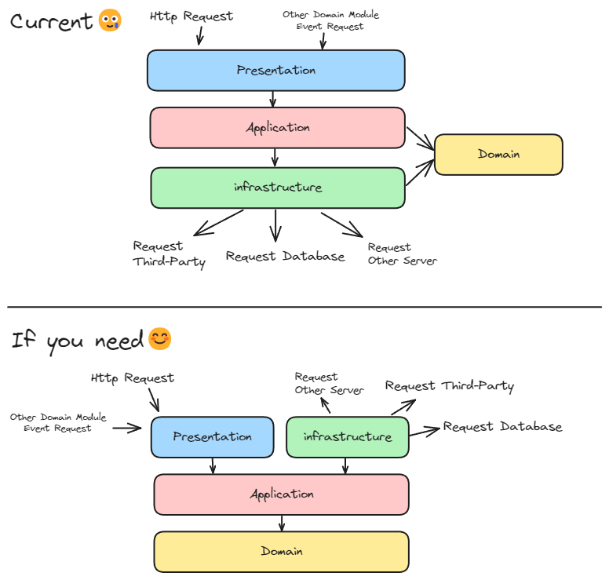

---
layout:
  title:
    visible: true
  description:
    visible: false
  tableOfContents:
    visible: true
  outline:
    visible: true
  pagination:
    visible: false
---

# 점진적인 클린아키택처를 위한 설계

<figure><figcaption></figcaption></figure>

## Modules 폴더 구조 및 규칙

modules 폴더는 여러 도메인 모듈(Domain Module)로 구성되어 있습니다. 각 모듈은 **점진적**으로 클린 아키텍처를 지향하고 있지만, 현재는 `usecase` 레이어에서 `infrastructure` 레이어를 직접 참조하기 때문에 완전한 클린 아키텍처는 아닙니다. 그러나, 엄격한 규칙을 지키는 것 대신에 단방향적인 흐름을 유지하고, 도메인 간의 결합도를 완화하며, 필요 시 리팩토링을 통해 클린 아키텍처로의 전환이 용이하도록 설계되었습니다.

### 허용되는 규칙

* 리포지토리, ORM 엔티티들을 `usecase layer`, `domain layer`에서 직접 사용:
  * 도메인 모듈들의 비즈니스 로직은 `typeorm`에 상당히 의존적입니다. 하지만, Node.js 진영에서 `typeorm`을 대체할 ORM은 많지 않기 때문에 기술 스택이 바뀌는 일은 향후 몇 년간은 없을 것이라 판단하였습니다.
  * 리포지토리는 별도의 인터페이스를 두지 않았습니다. 리포지토리를 의존 역전 시키더라도 도메인 엔티티 자체가 `typeorm`에 의존적이기 때문에, 둘 다 유즈케이스와 분리해주지 않는 한 리포지토리만 인터페이스를 만드는 것은 의미가 없다고 생각하였습니다. (추후에 유즈케이스를 단위 테스트한다고 하더라도, 테스트 라이브러리가 리포지토리 구현체를 가짜로 목킹하는 것이 가능하기 때문에 이 부분도 괜찮다고 판단)
  * 만약 클린 아키텍처로의 리팩토링을 고려한다면:
    * `usecase layer`에서 `interfaces` 폴더를 만들어 리포지토리 인터페이스를 정의하고, 유즈케이스들은 인터페이스에 의존합니다.
    * `domain layer` 엔티티에서 `typeorm` 의존성을 제거합니다.
    * `infrastructure layer`에서 `adapters` 폴더를 만들어 ORM을 사용하는 리포지토리가 인터페이스를 구현하도록 합니다.
    * `infrastructure layer`에서 `orm-entities` 폴더를 만들어 ORM을 사용하는 엔티티를 구현합니다.
    * `infrastructure layer`에서 `mappers` 폴더를 만들어 도메인 엔티티와 ORM 엔티티 간의 변환을 처리하는 매퍼를 작성하고, 리포지토리에서 사용합니다.

### 도메인 모듈 간 public API 참조 규칙

각각의 도메인 모듈들은 필연적으로 다른 도메인 모듈의 기능(유즈케이스, 유틸 서비스 등) 또는 타입(엔티티, DTO, 유틸 등)을 필요로 하게 됩니다. 이때 다른 모듈과의 상호작용은 다음 원칙 내에서만 이루어져야 합니다.

* 타입의 참조: 각 모듈의 루트 경로에 위치한 `index` 파일에 명시된 파일만 참조가 가능합니다. 이때 명시할 파일들은 엔티티, DTO, 유틸 등의 파일을 사용하는 것을 권장합니다.
* 기능의 참조:
  * 기능을 제공하는 도메인 모듈은 `presentation layer`에 이벤트 요청을 받을 수 있는 프레젠터를 준비합니다.
  * 외부 도메인의 기능을 참조하는 도메인 모듈은 `eventBus`를 통해 외부 모듈과 상호작용합니다.
  * 추가적으로 다음과 같은 방식도 고려할 수 있습니다:
    * 내부적인 HTTP 통신을 통한 상호작용
    * gRPC를 사용한 상호작용

### 레이어 구조

각 모듈은 다음과 같은 하위 폴더(Layer)로 구성됩니다:

* **api (presentation layer)**: 사용자 인터페이스와의 상호작용을 처리하는 폴더입니다.
* **app (usecase layer)**: 애플리케이션의 비즈니스 로직을 처리하는 폴더입니다.
* **domain (domain layer)**: 시스템의 핵심 비즈니스 규칙과 로직을 정의하는 폴더입니다.
* **infra (infrastructure layer)**: 선택적인 레이어로, 데이터베이스와 같은 외부 시스템과의 통신을 처리하는 폴더입니다.

### 레이어 설명

#### api (presentation layer)

* **목적**: 사용자 인터페이스와의 상호작용을 처리합니다.
* **구성 요소(예)**:
  * **controllers**: HTTP 요청을 처리하는 컨트롤러 등을 포함합니다.
  * **events**: 다른 도메인 모듈에게 필요한 기능 요청을 받을 수 있습니다.

**예시**

```plaintext
src/
├── modules/
│   ├── post/
│   │   ├── api/
│   │   │   ├── controllers/
│   │   │   │   ├── post.controller.ts
│   │   │   ├── events/
│   │   │   │   ├── post.event.ts
```

#### app(usecase layer)

* **목적**: 애플리케이션의 비즈니스 로직을 처리합니다.
* **구성요소**:
  * **usecase**: 특정 비즈니스 작업을 수행하는 유즈케이스를 포함합니다.
  * **dto**: 데이터 전송 객체를 포함합니다. 이는 계층 간 데이터 전달을 담당합니다.
  * **interface**: (리팩토링 시 필요) 유즈케이스에서 외부 인프라의 기능을 사용하기 위한 인터페이스들을 정의합니다. 인프라 레이어의 어뎁터들은 이 인터페이스를 구현하여 유즈케이스와 간접적으로 상호작용합니다.

**예시**

```plaintext
src/
├── modules/
│   ├── post/
│   │   ├── app/
│   │   │   ├── dto/
│   │   │   │   ├── create-post.dto.ts
│   │   │   │   ├── update-post.dto.ts
│   │   │   │   ├── res-post-detail.dto.ts
│   │   │   │   ├── res-post-list.dto.ts
│   │   │   ├── usecases/
│   │   │   │   ├── get-post.usecase.ts
│   │   │   │   ├── create-post.usecase.ts
│   │   │   │   ├── update-post.usecase.ts
│   │   │   │   ├── remove-post.usecase.ts
│   │   │   ├── interface/
│   │   │   │   ├── post.repository.ts
```

#### domain(domain layer)

* **목적**: 시스템의 핵심 비즈니스 규칙과 로직을 정의합니다.
* **구성요소**:
  * **entity**: 도메인 엔티티를 포함합니다.
  * **value-object**: 값 객체를 포함합니다.

```plaintext
src/
├── modules/
│   ├── post/
│   │   ├── domain/
│   │   │   ├── entities/
│   │   │   │   ├── post.entity.ts
│   │   │   │   ├── post-image.entity.ts
│   │   │   ├── vo/
│   │   │   │   ├── create-post.vo.ts
```

#### infra(infrastructure layer)

* **목적**: 데이터베이스와 같은 외부 시스템과의 통신을 처리합니다.
* **구성요소**:
  * **repository**: 데이터베이스와의 상호작용을 처리하는 리포지토리를 포함합니다.
  * **orm-entity**: (리팩토링시 필요) ORM 엔티티를 포함합니다. 이는 데이터베이스 테이블과 매핑됩니다.
  * **mapper**: (리팩토링시 필요) 도메인 엔티티와 ORM 엔티티 간의 변환을 처리하는 매퍼를 포함합니다.

```plaintext
src/
├── modules/
│   ├── post/
│   │   ├── infra/
│   │   │   ├── repositories/
│   │   │   │   ├── post.repository.ts
│   │   │   ├── entities/
│   │   │   │   ├── post.orm-entity.ts
│   │   │   │   ├── post-image.orm-entity.ts
│   │   │   ├── mappers/
│   │   │   │   ├── post.mapper.ts
```

### 레이어 내부 구조 자율성

각각의 `Layer`는 해당 레이어의 기능을 수행하는 파일들로 구성됩니다. 각 파일들은 역할에 따라 분류될 수 있으며, 이때 하위 폴더를 구성하는 것은 자율적이고 선택적입니다. 예를 들어, 레이어 내에 비슷한 성격의 파일이 한 개만 존재하는 경우에는 굳이 하위 폴더를 만들지 않아도 됩니다.

#### 예시

```plaintext
src/
├── modules/
│   ├── post/
│   │   ├── infra/
│   │   │   ├── entities/
│   │   │   │   ├── post.orm-entity.ts
│   │   │   │   ├── post-image.orm-entity.ts
│   │   │   ├── post.repository.ts
│   │   │   ├── post.mapper.ts
```
